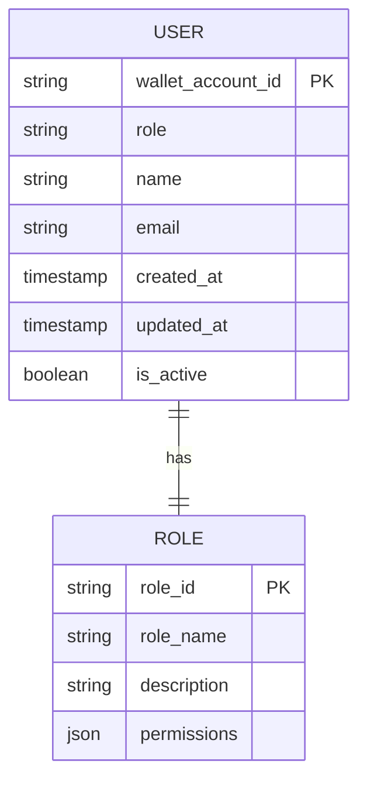
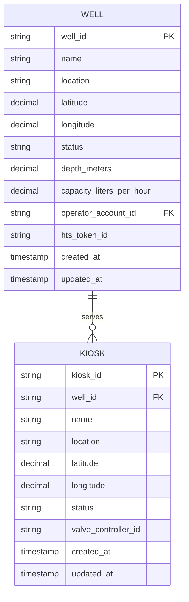
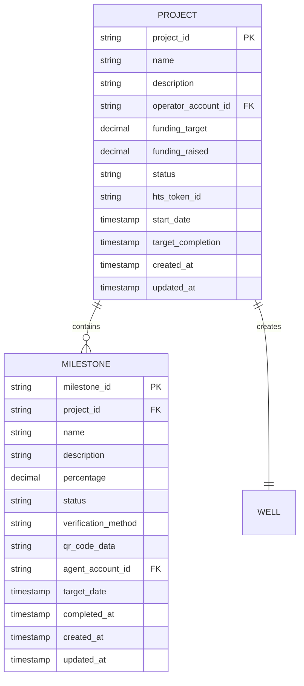
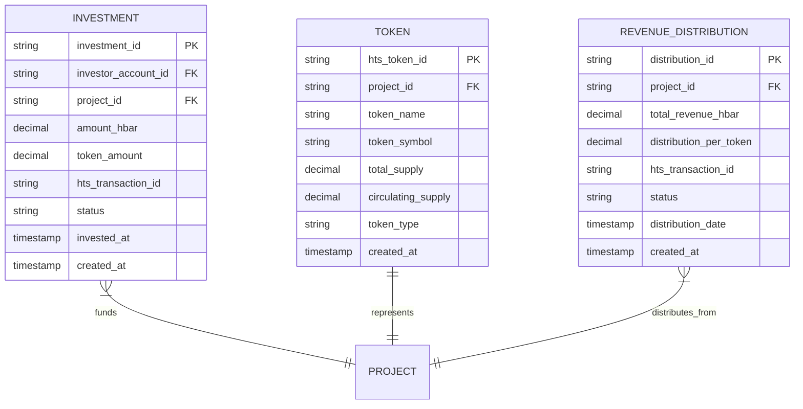
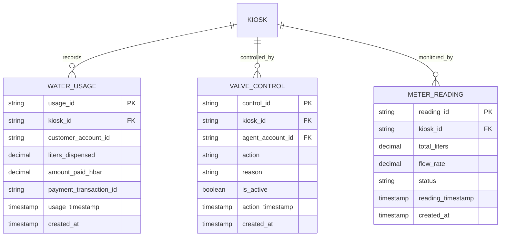
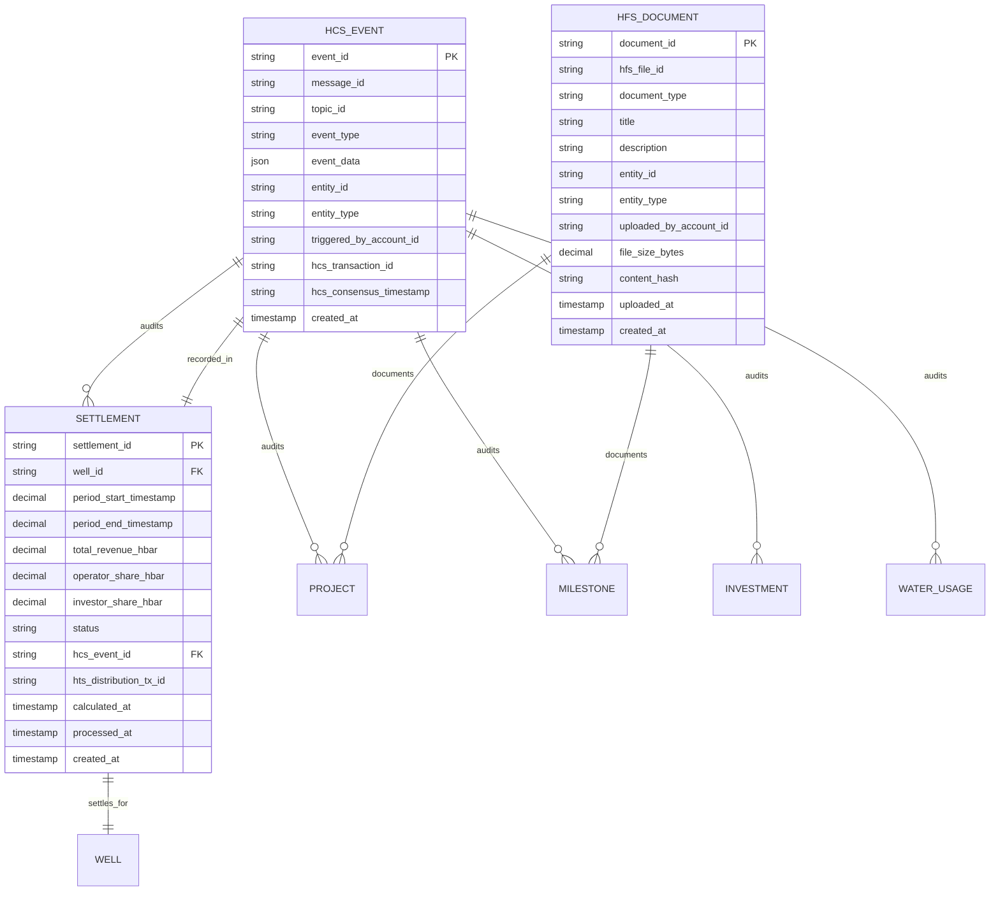

# Waternity ERD (Entity Relationship Diagram)

## Overview
ERD untuk sistem Waternity yang terintegrasi dengan Hedera Hashgraph services (HTS, HCS, HFS).

## Core Entities

### 1. User Management

### 2. Water Infrastructure

### 3. Project Management

### 4. Investment & Tokenization

### 5. Operations & Monitoring

### 6. Hedera Integration

## Key Relationships Summary

1. **Users & Roles**: Wallet-based authentication with role-based access control
2. **Infrastructure**: Wells serve multiple Kiosks for water distribution
3. **Projects**: Operators create projects with milestones, funded by investors
4. **Tokenization**: Each project can have HTS tokens representing ownership shares
5. **Operations**: Kiosks record usage, controlled by agents, monitored continuously
6. **Audit Trail**: All critical actions recorded as HCS events with immutable timestamps
7. **Document Storage**: Project documents and reports stored on HFS
8. **Revenue Sharing**: Automated settlements distribute revenue to token holders

## Hedera Services Integration

### HTS (Hedera Token Service)
- **Project Tokens**: Fungible tokens representing project ownership
- **Revenue Distribution**: Automated token-based revenue sharing
- **Investment Tracking**: Token transfers for investment records

### HCS (Hedera Consensus Service)
- **Audit Events**: All critical system actions logged immutably
- **Milestone Verification**: QR-based milestone completion proofs
- **Settlement Records**: Revenue distribution transparency
- **Valve Control**: Water access control audit trail

### HFS (Hedera File Service)
- **Project Documents**: Construction plans, permits, reports
- **Milestone Evidence**: Photos, certificates, compliance docs
- **Periodic Bundles**: Aggregated operational data archives

## Idempotency Implementation

- All write operations include `message_id` (UUID v4)
- Duplicate operations with same `message_id` are safely ignored
- Critical for retry scenarios and network reliability
- Implemented at both application and Hedera service levels

## Data Flow Architecture

1. **Write Operations** → Generate HCS Event → Update Local DB
2. **Document Uploads** → Store in HFS → Record metadata locally
3. **Token Operations** → Execute HTS transaction → Log in HCS
4. **Settlements** → Calculate locally → Distribute via HTS → Record in HCS
5. **Audit Queries** → Mirror Node API → Real-time verification

This ERD provides the foundation for a fully auditable, tokenized water infrastructure management system built on Hedera Hashgraph.